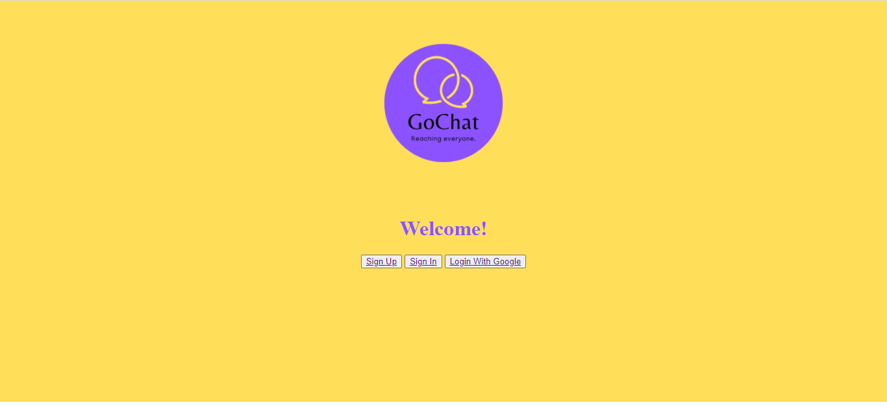

# chat_django

A login system in Python using Django.

## Description
This is a real time chat app system. When authenticated, the user can create a room and chat.

## Built with
* Python (3.10.1)
* Django
* HTTP
* Ajax

## Get started
1. Install the required libs
```
pip install -r requirements.txt
```
2. Create a new Gmail account.

This project sends emails through Gmail and to do so, the code needs permition. You can do it by editing security settings on your Gmail account. However, it's not cool doing it on your personal account. So, the best choice is to create a new one for this purpose.

Turn this option ON: https://myaccount.google.com/lesssecureapps

3. Insert your email's credentials on chat_system/chat_system/info.py.

4. Run run.bat or run using an IDE with the command:
```
python chat_system/manage.py runserver
```
5. Access http://localhost:8000/

6. Sign up, check your email's inbox and click on the link that was sent.

7. Your account is now active and you can create/enter a room to start a conversation.

## Screenshots




## Contact me
LinkedIn: https://www.linkedin.com/in/larissalimaqueiroz/